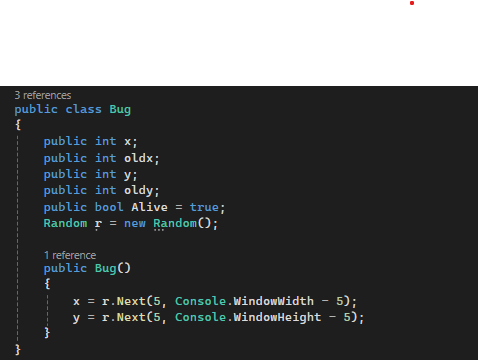
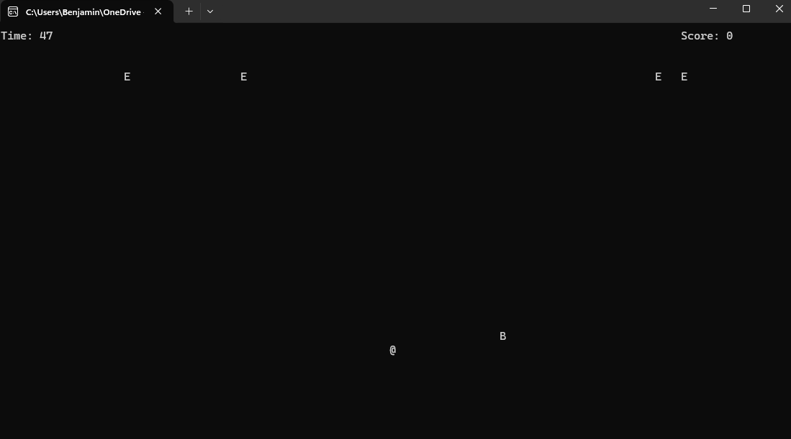
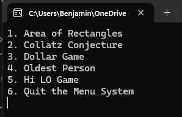

# My Projects
   1. **Retro Bug**
    - This project was my final project for year 1 and it is a shooter game.
    - I used Visual Studio 2022 as well as the C# language.

      
    
    - This was the first time i made a class in C# (sort of).

      

      - The user is playing as the `@` symbol and the enemies are the `E` symbol and if you collect the flying `B` you win! Kind of like a golden snitch in Harry Potter.
      - In this project I learned how to properly use classes as well as learning a constructer function.
   2. **Lab3**
      - This was my lab3 of my first programming class
      - Nothing really impressive but a fun Lab!
      - This Program makes the user choose between 1-5 games when the player chooses it plays the game.
      - Int32 choice;
      - Console.WriteLine("1. Area of Rectangles ");
      - Console.WriteLine("2. Collatz Conjecture ");
      - Console.WriteLine("3. Dollar Game ");
      - Console.WriteLine("4. Oldest Person ");
      - Console.WriteLine("5. Hi LO Game ");
      - Console.WriteLine("6. Quit the Menu System ");
      - choice = Convert.ToInt32(Console.ReadLine());

      - This is my Menu system that gets the users input and chooses the right option

      

      - From this project I learned how to properly implement the users input into a program.
